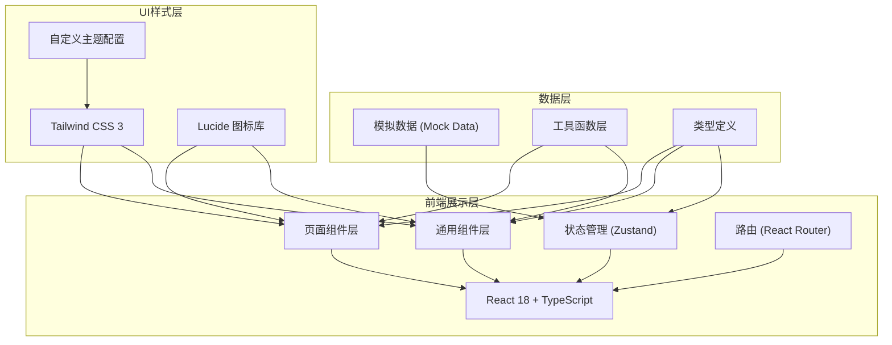
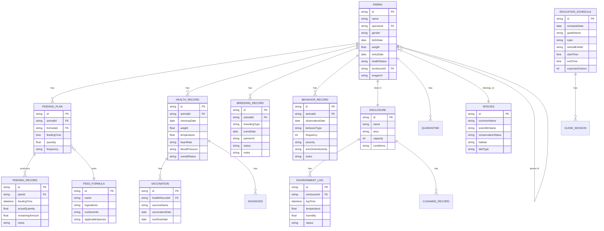

## 1. 架构设计



## 2. 技术描述

- **前端框架**：React@18 + TypeScript
- **构建工具**：Vite@5
- **样式方案**：Tailwind CSS@3
- **状态管理**：Zustand
- **路由管理**：React Router DOM@6
- **图标库**：Lucide React
- **后端**：无（纯前端演示，使用Mock数据）
- **数据存储**：前端内存存储 + LocalStorage持久化

## 3. 路由定义

| 路由路径 | 页面名称 | 功能说明 |
|----------|----------|----------|
| / | 首页/仪表盘 | 系统概览、关键数据指标、快捷入口 |
| /animals | 动物档案 | 动物个体档案、谱系血缘、检疫隔离 |
| /feeding | 饲喂管理 | 饲料配方、饲喂计划、投喂记录 |
| /health | 健康监测 | 体检记录、诊疗记录、疫苗接种 |
| /breeding | 繁育记录 | 发情监测、配种登记、幼崽哺育 |
| /enclosure | 笼舍环境 | 温湿度监控、清洁记录、安全检查 |
| /behavior | 行为观察 | 行为丰容、刻板行为、日常行为记录 |
| /education | 科普展示 | 讲解排班、参观互动、科普信息 |

## 4. 数据模型

### 4.1 数据模型定义



### 4.2 核心数据类型定义

```typescript
// 动物基本信息
interface Animal {
  id: string;
  name: string;
  speciesId: string;
  speciesName: string;
  gender: 'male' | 'female';
  birthDate: string;
  weight: number;
  entryDate: string;
  healthStatus: 'healthy' | 'sick' | 'quarantine' | 'recovering';
  enclosureId: string;
  enclosureName: string;
  imageUrl: string;
  pedigree?: {
    fatherId?: string;
    motherId?: string;
    childrenIds: string[];
  };
}

// 饲喂配方
interface FeedFormula {
  id: string;
  name: string;
  ingredients: Array<{ name: string; percentage: number }>;
  nutritionInfo: {
    protein: number;
    fat: number;
    carbohydrate: number;
    fiber: number;
  };
  applicableSpecies: string[];
}

// 健康记录
interface HealthRecord {
  id: string;
  animalId: string;
  animalName: string;
  checkupDate: string;
  veterinarian: string;
  weight: number;
  temperature: number;
  heartRate: number;
  diagnoses: Array<{
    condition: string;
    treatment: string;
    medication: string;
    followUpDate?: string;
  }>;
  vaccinations: Array<{
    vaccineName: string;
    date: string;
    nextDue: string;
  }>;
  overallStatus: string;
}

// 繁育记录
interface BreedingRecord {
  id: string;
  animalId: string;
  animalName: string;
  partnerId?: string;
  partnerName?: string;
  breedingType: 'estrus' | 'mating' | 'pregnancy' | 'birth';
  eventDate: string;
  status: string;
  notes: string;
  offspring?: Array<{
    id: string;
    name: string;
    birthDate: string;
    gender: string;
    status: string;
  }>;
}

// 笼舍环境
interface Enclosure {
  id: string;
  name: string;
  area: string;
  capacity: number;
  currentOccupancy: number;
  temperature: number;
  humidity: number;
  tempRange: { min: number; max: number };
  humidityRange: { min: number; max: number };
  lastCleaned: string;
  cleaningRecords: Array<{
    date: string;
    staff: string;
    method: string;
  }>;
}

// 行为观察
interface BehaviorRecord {
  id: string;
  animalId: string;
  animalName: string;
  observationDate: string;
  observer: string;
  behaviorType: 'normal' | 'stereotypic' | 'aggressive' | 'social';
  behaviorName: string;
  frequency: number;
  durationMinutes: number;
  severity?: 'mild' | 'moderate' | 'severe';
  enrichmentActivity?: string;
  notes: string;
}

// 科普讲解
interface EducationSchedule {
  id: string;
  date: string;
  guideName: string;
  guideAvatar: string;
  topic: string;
  animalExhibit: string;
  startTime: string;
  endTime: string;
  expectedVisitors: number;
  actualVisitors?: number;
  feedback?: string;
}
```

## 5. 项目结构

```
.
├── src/
│   ├── components/          # 通用组件
│   │   ├── Layout/          # 布局组件（侧边栏、顶栏、页脚）
│   │   ├── UI/              # 基础UI组件（按钮、卡片、表格、徽章等）
│   │   └── Charts/          # 图表组件
│   ├── pages/               # 页面组件
│   │   ├── Dashboard/       # 首页仪表盘
│   │   ├── Animals/         # 动物档案页
│   │   ├── Feeding/         # 饲喂管理页
│   │   ├── Health/          # 健康监测页
│   │   ├── Breeding/        # 繁育记录页
│   │   ├── Enclosure/       # 笼舍环境页
│   │   ├── Behavior/        # 行为观察页
│   │   └── Education/       # 科普展示页
│   ├── store/               # Zustand状态管理
│   ├── data/                # Mock数据
│   ├── types/               # TypeScript类型定义
│   ├── utils/               # 工具函数
│   ├── App.tsx              # 根组件
│   ├── main.tsx             # 入口文件
│   └── index.css            # 全局样式
├── .trae/documents/         # 项目文档
├── package.json
├── tsconfig.json
├── vite.config.ts
└── tailwind.config.js
```

## 6. 状态管理设计

### 主Store模块划分

- **useAnimalStore**: 动物档案、谱系、检疫数据管理
- **useFeedingStore**: 饲料配方、饲喂计划、投喂记录
- **useHealthStore**: 体检、诊疗、疫苗接种记录
- **useBreedingStore**: 繁育相关数据
- **useEnclosureStore**: 笼舍环境数据
- **useBehaviorStore**: 行为观察记录
- **useEducationStore**: 科普讲解排班与互动
