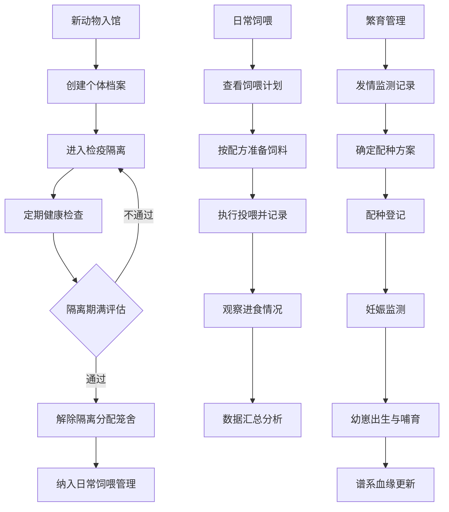

## 1. 产品概述

动物园饲养繁育管理Web系统，面向动物园饲养团队提供全方位的动物管理、饲喂计划、健康监测、繁育记录、笼舍环境监控、行为观察和科普展示功能。系统助力饲养员、兽医、繁育专家和科普人员高效协同工作，提升动物园科学化、数字化管理水平。

## 2. 核心功能

### 2.1 用户角色

| 角色 | 说明 | 核心权限 |
|------|------|----------|
| 饲养员 | 日常动物照护人员 | 饲喂记录、行为观察、笼舍环境登记、动物基础档案查看 |
| 兽医 | 动物健康诊疗人员 | 健康监测、体检记录、诊疗记录、检疫隔离管理 |
| 繁育专家 | 物种繁育管理人员 | 繁育记录、配种登记、谱系血缘管理、幼崽哺育 |
| 科普专员 | 公众教育讲解人员 | 科普展示、讲解排班、参观互动管理 |
| 管理员 | 系统管理人员 | 全部功能权限、用户管理、数据配置 |

### 2.2 功能模块

1. **动物档案页**：动物个体档案管理、谱系血缘管理、检疫隔离记录
2. **饲喂管理页**：饲料配方管理、饲喂计划、投喂记录
3. **健康监测页**：体检记录、诊疗记录、疫苗接种、健康预警
4. **繁育记录页**：发情监测、配种登记、妊娠管理、幼崽哺育
5. **笼舍环境页**：温湿度监控、清洁记录、环境安全检查
6. **行为观察页**：行为丰容、刻板行为观察、日常行为记录
7. **科普展示页**：科普讲解排班、参观互动、动物科普信息

### 2.3 页面详情

| 页面名称 | 模块名称 | 功能描述 |
|----------|----------|----------|
| 动物档案 | 个体档案卡片 | 展示动物基本信息（编号、名称、物种、性别、年龄、体重、入馆日期、健康状态） |
| 动物档案 | 谱系血缘树 | 可视化展示动物家族血缘关系，支持父母、子女、兄弟姐妹关系追溯 |
| 动物档案 | 检疫隔离 | 新入馆动物隔离观察记录，检疫结果登记，解除隔离审批 |
| 饲喂管理 | 饲料配方库 | 各类饲料配方（成分、营养配比、适用物种） |
| 饲喂管理 | 饲喂计划 | 按动物/物种制定每日饲喂计划（时间、种类、数量） |
| 饲喂管理 | 投喂记录 | 实际投喂登记（饲喂量、剩余量、异常情况） |
| 健康监测 | 体检记录 | 常规体检数据记录（体重、体温、心率、血液指标等） |
| 健康监测 | 诊疗记录 | 疾病诊断、治疗方案、用药记录、复诊提醒 |
| 健康监测 | 疫苗接种 | 疫苗种类、接种日期、下次接种提醒 |
| 繁育记录 | 发情监测 | 发情周期记录、发情状态标记、最佳配种时间预测 |
| 繁育记录 | 配种登记 | 配种双方信息、配种日期、配种方式、结果跟踪 |
| 繁育记录 | 幼崽哺育 | 出生记录、哺育计划、生长发育数据、断奶时间 |
| 笼舍环境 | 温湿度监控 | 实时/历史温湿度数据、阈值告警、环境趋势图 |
| 笼舍环境 | 清洁记录 | 笼舍清洁消毒登记、清洁人员、清洁方式 |
| 笼舍环境 | 安全检查 | 笼舍设施安全巡检记录、隐患排查、整改跟踪 |
| 行为观察 | 行为丰容 | 丰容设施配置、丰容活动记录、效果评估 |
| 行为观察 | 刻板行为观察 | 异常行为识别、发生频率、严重程度、干预措施 |
| 行为观察 | 日常行为记录 | 活动量、进食行为、社交行为等日常观察记录 |
| 科普展示 | 讲解排班 | 科普讲解员排班表、讲解时段、讲解主题、动物展区 |
| 科普展示 | 参观互动 | 互动活动安排、参与人数统计、游客反馈记录 |
| 科普展示 | 科普信息库 | 动物科普知识、物种介绍、保护级别、栖息地信息 |

## 3. 核心流程

### 主要业务流程描述

1. **新动物入馆流程**：动物抵达动物园 → 创建个体档案 → 进入检疫隔离 → 定期健康检查 → 隔离期满评估 → 解除隔离分配笼舍 → 纳入日常饲喂管理

2. **日常饲喂流程**：查看当日饲喂计划 → 按配方准备饲料 → 执行投喂并记录 → 观察进食情况 → 记录剩余量与异常 → 数据汇总分析

3. **健康诊疗流程**：发现动物异常 → 发起体检/诊疗 → 记录检查数据 → 诊断疾病制定方案 → 用药/治疗记录 → 跟踪康复情况 → 结案归档

4. **繁育管理流程**：发情监测记录 → 确定配种方案 → 配种登记 → 妊娠监测 → 预产期准备 → 幼崽出生记录 → 哺育期跟踪 → 谱系更新

5. **科普讲解流程**：制定月度讲解计划 → 讲解员排班 → 发布讲解时间表 → 现场执行讲解 → 收集游客反馈 → 效果评估改进

## 4. 用户界面设计

### 4.1 设计风格

- **主色调**：森林绿（#2D5A27）作为主色，体现自然、生态、专业的动物园氛围
- **辅助色**：暖橙色（#E8833A）用于强调和按钮，大地棕色（#8B6914）作为辅助
- **中性色**：浅米色（#F5F2EB）背景、深灰色（#333333）文字，营造温暖自然的阅读体验
- **按钮风格**：圆角设计（8px），主按钮使用森林绿配白色文字，悬停时有微妙阴影和颜色加深效果
- **字体**：标题使用思源宋体（Source Han Serif）体现稳重专业，正文使用思源黑体（Source Han Sans）保证可读性
- **布局风格**：卡片式布局搭配侧边导航栏，数据表格与信息卡片结合，图标采用自然生态风格
- **图标风格**：使用Lucide图标库，配合动物、植物、医疗等自然主题元素

### 4.2 页面设计概览

| 页面名称 | 模块名称 | UI元素 |
|----------|----------|--------|
| 动物档案 | 个体档案卡片 | 动物头像+编号、物种标签、状态徽章（健康/患病/隔离）、详细信息折叠面板、关键指标数据条 |
| 动物档案 | 谱系血缘树 | 树形结构可视化、节点颜色区分性别、点击节点查看详情、缩放拖动交互 |
| 饲喂管理 | 饲料配方库 | 配方卡片网格布局、营养成分进度条、适用物种标签、收藏/常用标记 |
| 饲喂管理 | 投喂日历 | 日历视图展示饲喂计划、每日投喂完成状态、颜色区分饲喂类型 |
| 健康监测 | 诊疗时间线 | 垂直时间线展示就诊历史、事件类型图标、诊断结果摘要卡片 |
| 健康监测 | 健康指标图表 | 折线图展示体重/体温变化趋势、区域高亮标记异常区间 |
| 繁育记录 | 配种进度 | 进度条展示繁育阶段、状态节点标记、时间轴记录关键事件 |
| 笼舍环境 | 温湿度仪表盘 | 圆形仪表盘显示实时数值、安全区域标记、告警阈值指示 |
| 笼舍环境 | 环境趋势图 | 双轴折线图展示温湿度24小时/7天变化趋势 |
| 行为观察 | 行为记录时间轴 | 横向时间轴展示观察事件、行为类型图标、严重程度标记 |
| 科普展示 | 讲解排班日历 | 周视图排班表、讲解员头像、展区标记、颜色区分主题类型 |
| 科普展示 | 动物科普卡片 | 大图展示、物种信息标签、保护等级徽章、科普简介展开 |

### 4.3 响应式设计

- 桌面端优先设计（1440px及以上）
- 平板端（768px-1439px）：侧边栏折叠为图标模式，卡片两列布局
- 移动端（<768px）：顶部导航栏+底部标签页，卡片单列布局，数据表格横向滚动
- 所有可交互元素触摸尺寸不小于44px×44px

### 4.4 动效与微交互

- 页面加载：内容区域淡入+上移动画，错开延迟创造层次感
- 卡片悬停：轻微上浮（translateY(-2px)）、阴影加深、边框高亮
- 导航切换：当前项平滑指示条动画
- 数据更新：数值变化时数字滚动动画
- 表单提交：成功/失败状态图标弹跳动画
